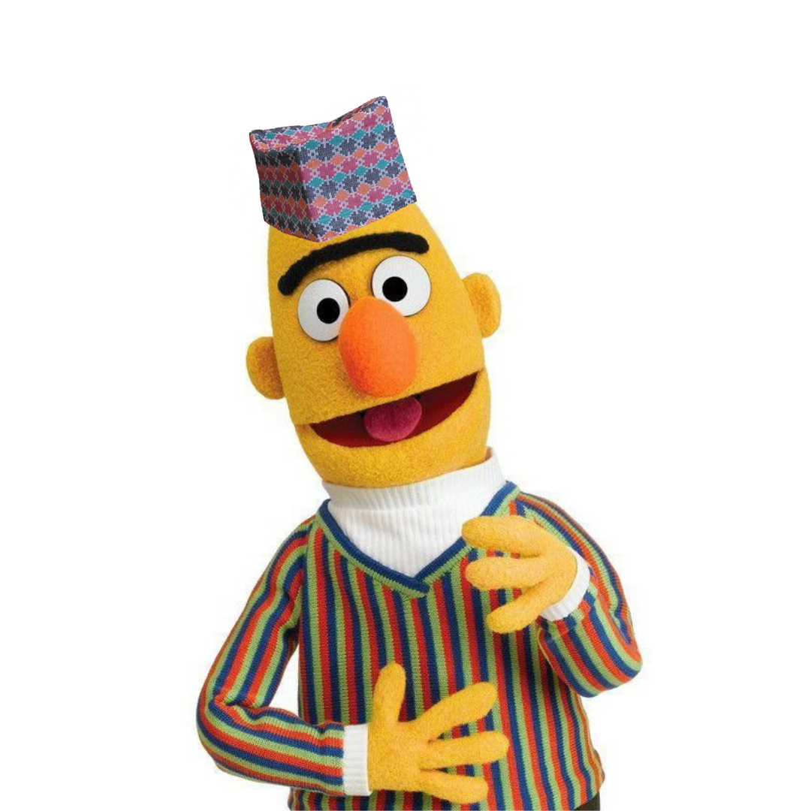

## NepBERT



### Purpose  Train a custom language model for nepali dataset to generate proper word embedding for Nepali text

## Features
- Trained on more than 200 millions of nepali sentences from nepali news dataset scrapped from several nepali news websites
- Text perplexity score of 60.78 on evaluation dataset containing more than 3000 nepali sentences
- Trained using NVIDIA-RTX 2080 for 3 days

## Usage

- First install transformers in your device using 
```console
foo@bar:~$ pip install transformers
```

```

from transformers import AutoTokenizer, AutoModelForMaskedLM

tokenizer = AutoTokenizer.from_pretrained("Shushant/NepNewsBERT")

model = AutoModelForMaskedLM.from_pretrained("Shushant/NepNewsBERT")

from transformers import pipeline

fill_mask = pipeline( "fill-mask", model=model, tokenizer=tokenizer, ) 
from pprint import pprint pprint(fill_mask(f"तिमीलाई कस्तो {tokenizer.mask_token}."))

```
